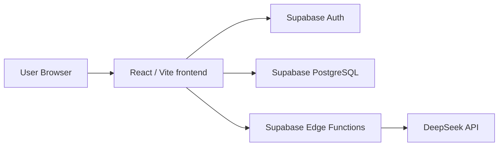

# StudyOS Flashcards SRS


## Deploy 
https://flashcards-srs-beta.vercel.app/

**StudyOS Flashcards SRS** - приложение для учебных карточек с AI-генерацией и интервальными повторениями.

Проект состоит из **React/Vite frontend**, **Supabase backend**, **Supabase Auth**, **PostgreSQL**, **Supabase Edge Functions** и интеграции с **DeepSeek**. Пользователь создает личные колоды, добавляет карточки вручную или через AI, тренируется по расписанию SRS и видит статистику повторений.

## Live Demo

[Демо](https://flashcards-srs-beta.vercel.app/)

## Скриншоты

Папка для скриншотов: `docs/screenshots/`.

## 📸 Скриншоты

| Экран | Превью |
|--------|--------|
| Главная |  |
| Регистрация / вход |  |
| Колоды |  |
| Карточки |  |
| AI-генерация |  |
| Профиль |  |


## Возможности

- Регистрация и вход через Supabase Auth по email/password.
- Личные колоды: создание, редактирование, удаление, поиск.
- Ручное создание карточек с типом, категорией и тегами.
- AI-генерация карточек через DeepSeek.
- Предпросмотр и выбор AI-карточек перед сохранением.
- Интервальные повторения на упрощенном SM-2.
- История повторений в таблице `reviews`.
- Dashboard со статистикой: карточки к сроку, точность, повторы за неделю, выученные карточки, общее число карточек и колод.
- Публичные колоды: публикация через `is_public`, просмотр каталога, копирование публичной колоды себе.
- Импорт и экспорт CSV.
- PWA: `manifest.json`, service worker, offline fallback для навигации.
- Светлая и темная тема. Переключатель есть на странице профиля, значение хранится в `localStorage`.
- Профиль частично реализован: таблица `profiles` есть в схеме, но текущий UI профиля показывает учебную статистику, а аватар и тема сохраняются локально в браузере.

## Архитектура

Клиентская часть работает в браузере: маршруты, формы, UI, вызовы Supabase SDK, импорт/экспорт CSV, расчет следующего повторения после оценки карточки. Supabase отвечает за Auth, PostgreSQL, RLS и Edge Functions. DeepSeek вызывается только из Edge Functions, не из браузера.



### Ответственность папок

- `frontend/src/pages` - страницы приложения: landing, login/register, dashboard, колоды, карточки, публичный каталог, тренировка, профиль.
- `frontend/src/components` - переиспользуемые UI-компоненты: layout, навигация, карточки, модальные окна, состояния загрузки и пустого списка.
- `frontend/src/services` - слой доступа к Supabase: auth, колоды, карточки, AI-функции, review/statistics.
- `frontend/src/utils` - вспомогательная логика: SRS, CSV, даты, русификация ошибок.
- `frontend/src/lib/supabaseClient.js` - создание Supabase client из `VITE_SUPABASE_URL` и `VITE_SUPABASE_ANON_KEY`.
- `backend/supabase/migrations` - SQL-схема, индексы и RLS-политики.
- `backend/supabase/functions/generate-cards` - Edge Function для генерации карточек через DeepSeek.
- `backend/supabase/functions/explain-card` - Edge Function для объяснения карточки через DeepSeek во время тренировки.

## Database Schema

Схема описана в `backend/supabase/migrations/001_initial_schema.sql`.

### `decks`

Колоды пользователя.

- `id uuid` - первичный ключ.
- `user_id uuid` - владелец, ссылка на `auth.users(id)`.
- `name text` - название, максимум 160 символов.
- `description text` - описание.
- `is_public boolean` - доступна ли колода в публичном каталоге.
- `created_at timestamptz` - дата создания.

### `cards`

Карточки внутри колод.

- `id uuid` - первичный ключ.
- `deck_id uuid` - ссылка на `decks(id)`.
- `front text` - лицевая сторона.
- `back text` - обратная сторона.
- `card_type text` - `basic`, `reverse`, `multiple_choice` или `cloze`.
- `options jsonb` - варианты ответа для расширенных типов.
- `correct_answer text` - правильный ответ для расширенных типов.
- `category text` - категория.
- `tags text[]` - теги.
- `interval_days integer` - текущий интервал повторения.
- `next_review_at timestamptz` - когда карточка снова доступна к повторению.
- `ease_factor numeric(4,2)` - коэффициент легкости.
- `created_at timestamptz` - дата создания.

### `reviews`

Журнал повторений.

- `id uuid` - первичный ключ.
- `card_id uuid` - ссылка на `cards(id)`.
- `rating text` - `again`, `hard`, `normal`, `easy`.
- `reviewed_at timestamptz` - дата оценки.

### `profiles`

Профили пользователей.

- `user_id uuid` - первичный ключ и ссылка на `auth.users(id)`.
- `display_name text` - отображаемое имя.
- `created_at timestamptz` - дата создания.

## Row-Level Security

**RLS**, Row-Level Security, - механизм PostgreSQL/Supabase, который проверяет доступ на уровне каждой строки таблицы. Для frontend-приложения это критично: браузер использует публичный anon key, поэтому безопасность не может держаться только на UI-проверках.

В проекте RLS включен для `decks`, `cards`, `reviews`, `profiles`. Это не дает пользователю A читать или менять приватные данные пользователя B, даже если A вручную отправит запрос в Supabase API.

Ключевые политики из миграции:

- `decks`: читать можно свои колоды или публичные; создавать, обновлять и удалять можно только строки с `auth.uid() = user_id`.
- `cards`: читать можно карточки из своих или публичных колод; создавать, обновлять и удалять карточки можно только внутри своих колод.
- `reviews`: читать и создавать review можно только для карточек, которые лежат в колодах текущего пользователя.
- `profiles`: читать, создавать и обновлять можно только свой профиль.

Пример логики политики для карточек:

```sql
exists (
  select 1 from public.decks
  where decks.id = cards.deck_id
  and (decks.is_public = true or decks.user_id = auth.uid())
)
```

Если отключить RLS, любой клиент с anon key мог бы попытаться читать, изменять или удалять чужие строки через REST API Supabase. Frontend-защита не помогла бы, потому что ее можно обойти прямым HTTP-запросом.

## Безопасность API-ключей

DeepSeek API key нельзя хранить во frontend-коде: все переменные Vite с префиксом `VITE_` попадают в browser bundle. Если положить туда приватный ключ, его можно будет увидеть в DevTools, украсть и использовать за счет владельца проекта.

В этом проекте React не вызывает DeepSeek напрямую. Клиент вызывает Supabase Edge Function:

```js
// frontend/src/services/aiService.js
const { data, error } = await supabase.functions.invoke("generate-cards", {
  body
});
```

Edge Function читает секрет на серверной стороне:

```ts
// backend/supabase/functions/generate-cards/index.ts
const apiKey = Deno.env.get("DEEPSEEK_API_KEY");
if (!apiKey) throw new Error("DEEPSEEK_API_KEY не настроен");
```

`DEEPSEEK_API_KEY` должен храниться только в Supabase Secrets. Реальные секреты не коммитятся в репозиторий и не передаются в браузер.

## SRS Algorithm

SRS реализован в `frontend/src/utils/srs.js`, а применение результата - в `frontend/src/services/reviewService.js`.

Карточка хранит:

- `interval_days` - текущий интервал в днях.
- `ease_factor` - коэффициент, насколько быстро растет интервал.
- `next_review_at` - дата, когда карточка снова станет доступной.

Рейтинги:

- **Не знал** (`again`) - интервал сбрасывается до 1 дня, `ease_factor` уменьшается на `0.25`.
- **Сложно** (`hard`) - интервал остается текущим, `ease_factor` уменьшается на `0.15`.
- **Норм** (`normal`) - интервал умножается на текущий `ease_factor`.
- **Легко** (`easy`) - интервал умножается на `ease_factor`, а `ease_factor` дополнительно растет на `0.15`.

Фрагмент реальной реализации:

```js
if (rating === "again") {
  intervalDays = 1;
  easeFactor = currentEase - 0.25;
}

easeFactor = Math.max(1.3, Number(easeFactor.toFixed(2)));
intervalDays = Math.max(1, Math.round(intervalDays));
```

После оценки сначала создается запись в `reviews`, затем обновляется карточка:

```js
// frontend/src/services/reviewService.js
await supabase.from("reviews").insert({ card_id: card.id, rating });
const update = calculateNextReview(card, rating);
await supabase.from("cards").update(update).eq("id", card.id).select().single();
```

Такие интервалы полезны тем, что сложные карточки быстро возвращаются, а простые постепенно уходят дальше в будущее. Если 100 карточек оценить как **"Не знал"**, все они снова будут назначены примерно на следующий день, создавая большую очередь повторения. Если 100 карточек оценить как **"Легко"**, интервалы вырастут быстрее, и эти карточки разгрузят ближайшие тренировки.

## JOINs vs Separate Queries

В проекте используются оба подхода.

`frontend/src/services/deckService.js`:

- `listDecks()` и `listPublicDecks()` используют вложенный select `select("*, cards(count)")`, чтобы получить колоды и количество карточек.
- `copyPublicDeck()` делает отдельные запросы: сначала получает исходную колоду через `getDeck(deckId)`, затем карточки через `from("cards").select("*").eq("deck_id", deckId)`, затем создает новую колоду и вставляет скопированные карточки.

`frontend/src/services/cardService.js`:

- `listCards(deckId)` загружает карточки отдельным запросом по `deck_id`.
- `dueCards()` использует join-подобный Supabase select `select("*, decks!inner(id, name, user_id)")`, чтобы выбрать только карточки из колод текущего пользователя.

`frontend/src/services/reviewService.js`:

- `dashboardStats()` использует несколько отдельных агрегирующих запросов с `count: "exact"` и inner join `decks!inner(user_id)` там, где нужно ограничить карточки текущим пользователем.

Этот подход приемлем для текущего масштаба: код проще читать, RLS остается главным уровнем защиты, а тяжелых экранов с тысячами связанных сущностей пока нет. При росте нагрузки статистику можно вынести в SQL views или RPC-функции.

## Edge Function vs Обычный Backend Server

Supabase Edge Function - серверная функция на Deno, которая деплоится рядом с Supabase-инфраструктурой и вызывается через `supabase.functions.invoke`.

Почему здесь выбрана Edge Function:

- нужен безопасный серверный слой для DeepSeek API key;
- не требуется отдельный Express/FastAPI сервер;
- функции маленькие и хорошо изолированы: `generate-cards`, `explain-card`;
- удобно хранить секреты в Supabase и вызывать функцию из Supabase client.

Отличие от обычного backend-сервера:

- Express/FastAPI обычно является долгоживущим сервисом с собственным хостингом, роутингом, middleware, логированием и деплоем.
- Edge Function - отдельный serverless endpoint, который стартует по запросу и не требует поддержки полноценного backend-процесса.

Плюсы для проекта: меньше инфраструктуры, безопасные секреты, быстрый деплой. Минусы: меньше контроля над runtime, лимитами и сложными фоновой обработкой. Для AI-генерации карточек этот trade-off подходит.

## Authentication

Авторизация реализована через Supabase Auth email/password:

- регистрация: `supabase.auth.signUp({ email, password })`;
- вход: `supabase.auth.signInWithPassword({ email, password })`;
- получение сессии: `supabase.auth.getSession()`;
- выход: `supabase.auth.signOut()`.

Supabase client создан с:

```js
auth: {
  persistSession: true,
  autoRefreshToken: true,
  detectSessionInUrl: true
}
```

После входа Supabase JS SDK сохраняет сессию в браузере, обычно в `localStorage`: access token, refresh token и метаданные пользователя. Это удобно для автологина и обновления токенов, но кража токена опасна: злоумышленник сможет временно действовать как пользователь.

RLS все равно важен: даже с валидным токеном пользователь должен получать доступ только к тем строкам, которые разрешены политиками. Logout вызывает `signOut()`, удаляет активную сессию Supabase на клиенте и возвращает пользователя в неавторизованное состояние.

## Environment Variables

### Frontend `.env`

Файл: `frontend/.env`.

```bash
VITE_SUPABASE_URL=
VITE_SUPABASE_ANON_KEY=
```

Где используется:

- `VITE_SUPABASE_URL` - URL Supabase проекта в `frontend/src/lib/supabaseClient.js`.
- `VITE_SUPABASE_ANON_KEY` - публичный anon key Supabase в `frontend/src/lib/supabaseClient.js`.

### Supabase Edge Function Secrets

```bash
DEEPSEEK_API_KEY=
DEEPSEEK_MODEL=deepseek-chat
```

Где используется:

- `DEEPSEEK_API_KEY` - читается в `generate-cards` и `explain-card` через `Deno.env.get`.
- `DEEPSEEK_MODEL` - опциональная модель; если не задана, функции используют `deepseek-chat`.

## Local Setup

```bash
git clone <REPOSITORY_URL>
cd flashcards-srs/frontend
npm install
cp .env.example .env
npm run dev
```

Production build:

```bash
npm run build
```

## Supabase Setup

1. Создайте проект в Supabase.
2. Примените миграцию из `backend/supabase/migrations/001_initial_schema.sql`.
3. Задеплойте Edge Functions из `backend/supabase/functions/generate-cards` и `backend/supabase/functions/explain-card`.
4. Добавьте секреты `DEEPSEEK_API_KEY` и при необходимости `DEEPSEEK_MODEL`.
5. Включите/настройте Auth email/password.
6. Укажите Site URL и Redirect URLs для локальной разработки и Vercel-домена.

Пример команд Supabase CLI:

```bash
supabase functions deploy generate-cards
supabase functions deploy explain-card
supabase secrets set DEEPSEEK_API_KEY=your_key_here
supabase secrets set DEEPSEEK_MODEL=deepseek-chat
```

## Deployment

Для Vercel:

- **Root Directory:** `frontend`
- **Framework Preset:** Vite
- **Build Command:** `npm run build`
- **Output Directory:** `dist`
- **Environment Variables:** `VITE_SUPABASE_URL`, `VITE_SUPABASE_ANON_KEY`

После деплоя добавьте Vercel URL в Supabase Auth:

- **Site URL:** production URL приложения.
- **Redirect URLs:** production URL и локальный URL разработки, например `http://localhost:5173`.

DeepSeek secrets добавляются не в Vercel, а в Supabase Secrets, потому что DeepSeek вызывается из Edge Functions.

## Defense / Interview Questions

**Что такое RLS?**  
Row-Level Security - защита строк в PostgreSQL. Она проверяет каждую операцию `select/insert/update/delete` и решает, какие строки доступны текущему `auth.uid()`.

**Почему DeepSeek key не лежит во frontend?**  
Frontend-код доступен пользователю. Любой ключ в bundle можно украсть из DevTools или network/source files.

**Как работает SRS?**  
После оценки карточки приложение пересчитывает `interval_days`, `ease_factor` и `next_review_at`. Чем легче карточка, тем дальше следующее повторение.

**Что происходит во время AI-генерации?**  
React отправляет текст и количество карточек в `generate-cards`. Edge Function берет `DEEPSEEK_API_KEY` из секретов, вызывает DeepSeek, нормализует JSON и возвращает карточки в UI для выбора.

**Что происходит после оценки карточки?**  
В `reviews` добавляется запись с рейтингом, затем карточка обновляется новым интервалом и датой следующего повторения.

**Edge Function vs normal server?**  
Edge Function - serverless endpoint внутри Supabase. Отдельный Express/FastAPI сервер дал бы больше контроля, но потребовал бы отдельного хостинга и поддержки.

**Где хранится auth?**  
Supabase JS SDK при `persistSession: true` хранит сессию в браузере, обычно в `localStorage`, и автоматически обновляет токены.

**Что если token украден?**  
Злоумышленник может действовать как пользователь, пока токен валиден. Поэтому важны HTTPS, отсутствие XSS, logout, короткая жизнь access token и RLS, который не даст такому токену выйти за права конкретного пользователя.

## Project Structure

```text
frontend/
  src/
    components/
    lib/
    pages/
    services/
    styles/
    utils/
  assets/
  manifest.json
  service-worker.js

backend/
  supabase/
    migrations/
      001_initial_schema.sql
    functions/
      generate-cards/
      explain-card/

legacy-vanilla/
  js/
  *.html

references/
  ui-reference-01.png
```


